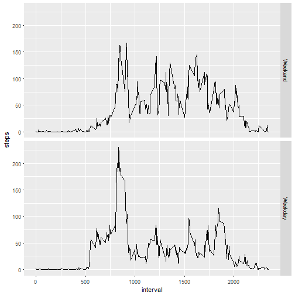

---
output:
  html_document: default
  pdf_document: default
  keep_md: default  

---


## Activity monitoring analysis

It is now possible to collect a large amount of data about personal movement using activity monitoring devices such as a [Fitbit]{http://www.fitbit.com/}, [Nike Fuelband]{http://www.nike.com/us/en_us/c/nikeplus-fuelband}, or [Jawbone Up]{https://jawbone.com/up}. These type of devices are part of the "quantified self" movement - a group of enthusiasts who take measurements about themselves regularly to improve their health, to find patterns in their behavior, or because they are tech geeks. But these data remain under-utilized both because the raw data are hard to obtain and there is a lack of statistical methods and software for processing and interpreting the data.

**Loading the date and store in `activity` data frame**


```r
setwd("C:/Users/kkolaro/Desktop/Private/ucenje/Coursera/Reproducible Research/")
activity<-read.csv("activity.csv")
str(activity)
```

```
## 'data.frame':	17568 obs. of  3 variables:
##  $ steps   : int  NA NA NA NA NA NA NA NA NA NA ...
##  $ date    : Factor w/ 61 levels "2012-10-01","2012-10-02",..: 1 1 1 1 1 1 1 1 1 1 ...
##  $ interval: int  0 5 10 15 20 25 30 35 40 45 ...
```

```r
summary(activity)
```

```
##      steps                date          interval     
##  Min.   :  0.00   2012-10-01:  288   Min.   :   0.0  
##  1st Qu.:  0.00   2012-10-02:  288   1st Qu.: 588.8  
##  Median :  0.00   2012-10-03:  288   Median :1177.5  
##  Mean   : 37.38   2012-10-04:  288   Mean   :1177.5  
##  3rd Qu.: 12.00   2012-10-05:  288   3rd Qu.:1766.2  
##  Max.   :806.00   2012-10-06:  288   Max.   :2355.0  
##  NA's   :2304     (Other)   :15840
```

**Histogram of the total number of steps taken each day**


```r
library(dplyr)
library(ggplot2)
tt<-na.omit(activity)
grupa<-group_by(tt,date)
s<-summarise(grupa, steps=sum(steps))
steps_day <- aggregate(steps ~ date, activity, sum)
qplot(steps,data = s)
```

```
## `stat_bin()` using `bins = 30`. Pick better value with `binwidth`.
```


```r
hist(steps_day$steps, main = paste( "Steps per Day"), col="blue", xlab="Number of Steps")
```


```r
rmean <- mean(steps_day$steps)
rmedian <- median(steps_day$steps)
```


**The mean steps per day is 1.0766189 &times; 10<sup>4</sup>  and the median is 10765**


##Time series plot of the average number of steps taken


```r
goup_interval <- group_by(tt, interval)
steps_per_int <- summarize(goup_interval, steps=mean(steps))
ggplot(steps_per_int, aes(x=interval, y=steps)) + geom_line()
```


```r
max_number_of_steps <-steps_per_int[steps_per_int$steps==max(steps_per_int$steps),1]
```

**The 5-minute interval that, on average, contains the maximum number of steps is 835**


## Adding  the mean number of steps for respective interval, where the number of steps are NA


```r
names(steps_per_int)[2]<-"mean.step"
mer_bezNA<-merge(activity,steps_per_int)
mer_bezNA$steps[is.na(mer_bezNA$steps)]<-mer_bezNA$mean.step[is.na(mer_bezNA$steps)]
```

## Histogram of the total number of steps taken each day after missing values are imputed


```r
agrup_date<-group_by(mer_bezNA,date)
steps_per_day<-summarize(agrup_date,steps=sum(steps))

hist(steps_per_day$steps, main = paste( "Steps per Day"), col="blue", xlab="Number of Steps")
```


```r
mean_bezNA<-mean(steps_per_day$steps)
median_bezNA<-median(steps_per_day$steps)
```
**The mean number of steps per date  is 1.0766189 &times; 10<sup>4</sup>, median number of steps 1.0766189 &times; 10<sup>4</sup>**


##Panel plot comparing the average number of steps taken per 5-minute interval across weekdays and weekends

```r
mer_bezNA$weekday<-weekdays(as.Date(mer_bezNA$date))
mer_bezNA$weekend<-as.factor(mer_bezNA$weekday=="Saturday"|mer_bezNA$weekday=="Sunday")
levels(mer_bezNA$weekend)<-c("Weekday","Weekend")
mer_bezNA.weekend <- mer_bezNA[mer_bezNA$weekend=="Weekend",]
mer_bezNA.weekday <- mer_bezNA[mer_bezNA$weekend=="Weekday",]

mer_bezNA.weekday<-group_by(mer_bezNA.weekday,interval)
mer_bezNA.weekday <- summarize(mer_bezNA.weekday, steps=mean(steps))

mer_bezNA.weekend<-group_by(mer_bezNA.weekend,interval)
mer_bezNA.weekend <- summarize(mer_bezNA.weekend, steps=mean(steps))

mer_bezNA.weekday$weekend<-"Weekday"
mer_bezNA.weekend$weekend<-"Weekand"

weekday_weekend<-rbind(mer_bezNA.weekday,mer_bezNA.weekend)
weekday_weekend$weekend<-as.factor(weekday_weekend$weekend)
ggplot(weekday_weekend, aes(interval, steps)) + geom_line() + facet_grid(weekend ~ .)
```




